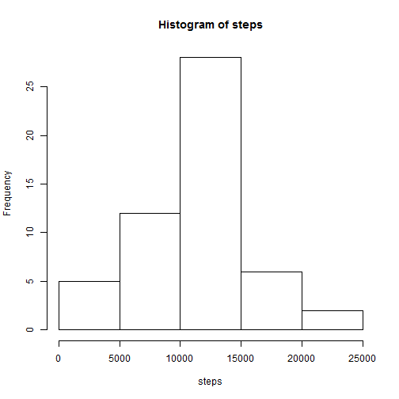
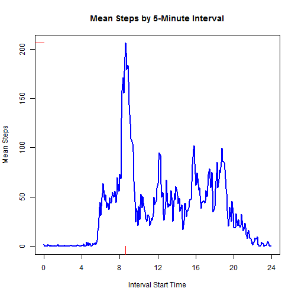
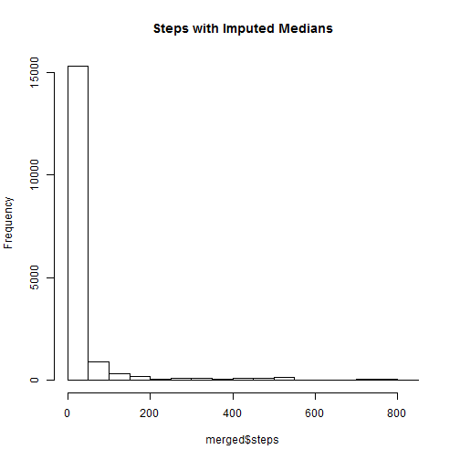
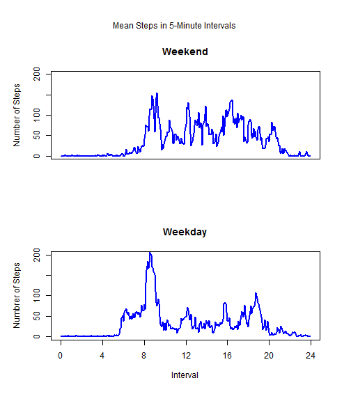

## Loading and pre-processing the data


```r
library (lubridate)

get.data = function() {
   data = read.csv("activity.csv", na.strings = "NA", as.is = T)
   print (dim(data))
   head(data)
   data$date = mdy(data$date)
 
   data$hour         = floor(data$interval / 100)
   data$minute       = data$interval - 100 * data$hour
   data$time.of.day  = paste(data$hour, data$minute, sep = ":")
   data$time         = data$hour + data$minute / 60
 
   data
}

data = get.data()
```

```
## [1] 17568     3
```
Let's take a quick look at the data.


```r
   print (table(data$steps, useNA = "always"))
```

```
## 
##     0     1     2     3     4     5     6     7     8     9    10    11 
## 11014     7     8     3    25    17    33    87    83    61    46    43 
##    12    13    14    15    16    17    18    19    20    21    22    23 
##    43    42    30    68    65    61    50    51    53    38    46    40 
##    24    25    26    27    28    29    30    31    32    33    34    35 
##    42    40    34    45    42    36    37    41    44    48    35    46 
##    36    37    38    39    40    41    42    43    44    45    46    47 
##    37    33    45    44    39    24    31    37    31    22    38    24 
##    48    49    50    51    52    53    54    55    56    57    58    59 
##    24    30    29    27    32    23    18    33    25    28    28    24 
##    60    61    62    63    64    65    66    67    68    69    70    71 
##    30    21    31    24    27    22    22    17    24    18    20    26 
##    72    73    74    75    76    77    78    79    80    81    82    83 
##    16    13    25    18    18    15    18    18    19    13    17    10 
##    84    85    86    87    88    89    90    91    92    93    94    95 
##    10    14    14     6    14     9    12     7    14     6    12    13 
##    96    97    98    99   100   101   102   103   104   105   106   107 
##     7    10     8     9     8    12     7    10     8     9     9     8 
##   108   109   110   111   112   113   114   115   116   117   118   119 
##     7     8     7    11    10     6    10     6     5    10     4    13 
##   120   121   122   123   124   125   126   127   128   129   130   131 
##     8     6     7     7     8     1     3     6    10     7     3     6 
##   132   133   134   135   136   137   138   139   140   141   142   143 
##     2     3     2    10     6     9     7     7     2     3     6    10 
##   144   145   146   147   148   149   150   151   152   153   154   155 
##     5     3     9     1     7     6     2     2     6     8     8     2 
##   156   157   158   159   160   161   162   163   164   165   166   167 
##     6     4     5     6     4     5     1     5     3     2     4     4 
##   168   170   171   172   173   174   175   176   177   178   179   180 
##     8     8     6     7     6     7     3     6     1     4     6     4 
##   181   182   183   184   185   186   187   188   189   190   191   192 
##     3     3     3     3     3     4     2     4     3     7     1     2 
##   193   194   195   196   197   198   199   200   201   202   203   204 
##     5     3     1     1     5     4     3     2     3     2     6     3 
##   205   206   207   208   209   210   211   212   213   214   216   219 
##     3     1     3     2     1     1     3     1     1     1     2     2 
##   221   223   224   225   229   230   231   232   235   236   237   238 
##     2     4     1     2     1     2     2     3     1     1     2     2 
##   240   241   242   243   244   245   247   248   249   250   251   252 
##     1     2     2     3     1     3     3     1     1     2     1     2 
##   253   254   255   256   257   258   259   260   261   262   263   264 
##     1     1     1     1     3     1     1     7     1     2     2     3 
##   265   266   267   269   270   271   272   274   275   276   277   279 
##     1     4     2     2     1     1     3     2     3     2     4     3 
##   280   281   282   283   284   285   286   287   289   290   291   292 
##     2     5     2     2     2     3     5     1     1     2     2     2 
##   293   294   295   297   298   299   301   302   303   304   305   306 
##     2     2     1     1     5     1     2     1     1     1     1     3 
##   307   308   309   310   311   312   313   314   315   316   317   318 
##     1     2     1     4     3     2     1     2     1     2     2     1 
##   319   320   321   322   323   324   325   326   327   328   330   331 
##     4     1     3     2     2     2     2     2     1     2     2     1 
##   332   333   334   335   336   339   340   341   343   344   345   346 
##     3     1     4     3     1     1     2     1     2     1     3     1 
##   347   349   350   351   353   354   355   356   357   358   359   360 
##     1     4     1     4     1     1     1     2     1     3     1     1 
##   361   362   363   364   365   366   368   370   371   372   373   374 
##     2     2     1     4     1     3     1     1     3     1     1     2 
##   375   376   377   378   380   384   385   387   388   389   391   392 
##     1     1     4     1     2     1     1     2     1     3     2     2 
##   393   394   395   396   397   399   400   401   402   403   404   405 
##     5     1     3     2     2     2     4     2     2     3     3     1 
##   406   408   410   411   412   413   414   415   416   417   418   419 
##     2     2     1     4     2     5     2     3     3     1     3     1 
##   421   422   423   424   425   426   427   428   429   431   432   433 
##     1     1     1     1     3     1     1     1     2     1     4     3 
##   434   435   436   437   439   440   441   442   443   444   446   449 
##     1     2     1     2     4     4     2     1     4     4     4     1 
##   450   451   453   454   456   457   458   459   461   462   463   464 
##     2     3     3     2     1     2     1     1     1     2     4     1 
##   465   466   467   468   469   470   471   472   473   474   475   476 
##     4     2     1     5     2     1     1     2     4     1     4     4 
##   477   478   479   480   481   482   483   484   485   486   487   488 
##     1     1     2     1     1     3     4     1     4     2     2     3 
##   489   490   491   492   493   494   495   496   497   498   499   500 
##     6     1     2     1     2     3     4     3     2     2     4     3 
##   501   503   504   505   506   507   508   509   510   511   512   513 
##     3     2     6     3     3     4     4     3     2     6     3     4 
##   514   515   516   517   518   519   520   521   522   523   524   526 
##     1     4     2     3     2     6     2     1     5     4     2     5 
##   527   528   529   530   531   532   533   534   535   536   537   539 
##     4     3     5     2     1     3     8     3     1     2     1     1 
##   540   541   542   544   545   546   547   548   549   551   553   555 
##     5     2     2     2     1     4     1     1     2     1     1     2 
##   556   559   562   567   568   569   571   573   574   577   581   584 
##     1     1     1     1     2     1     1     1     1     1     1     1 
##   591   592   594   597   600   602   606   608   611   612   613   614 
##     1     1     1     1     1     1     1     1     1     1     3     1 
##   618   619   625   628   630   634   635   637   638   639   643   652 
##     1     2     1     1     1     1     1     1     1     1     1     3 
##   655   659   662   665   667   668   679   680   681   682   686   687 
##     1     2     1     1     1     1     1     2     1     1     1     1 
##   690   693   697   698   701   706   708   709   710   713   714   715 
##     1     1     1     1     1     2     1     1     1     2     1     2 
##   717   718   720   721   725   726   727   729   730   731   732   733 
##     1     1     1     4     1     2     1     1     1     3     2     4 
##   734   735   736   737   738   739   741   742   743   744   745   746 
##     1     2     1     2     1     2     1     3     3     2     1     2 
##   747   748   749   750   751   752   753   754   755   756   757   758 
##     4     4     2     3     1     1     2     2     3     2     4     5 
##   759   760   765   766   767   768   769   770   777   781   783   785 
##     2     2     1     1     1     1     1     3     1     1     1     3 
##   786   789   794   802   806  <NA> 
##     1     1     1     1     1  2304
```

```r
   print (str(data))
```

```
## 'data.frame':	17568 obs. of  7 variables:
##  $ steps      : int  NA NA NA NA NA NA NA NA NA NA ...
##  $ date       : POSIXct, format: "2012-10-01" "2012-10-01" ...
##  $ interval   : int  0 5 10 15 20 25 30 35 40 45 ...
##  $ hour       : num  0 0 0 0 0 0 0 0 0 0 ...
##  $ minute     : num  0 5 10 15 20 25 30 35 40 45 ...
##  $ time.of.day: chr  "0:0" "0:5" "0:10" "0:15" ...
##  $ time       : num  0 0.0833 0.1667 0.25 0.3333 ...
## NULL
```

Note the large number of miossing values for steps.

##  What is the mean total number of steps taken per day?

At this point, we decide to treat the missing values for steps as if they did not exist.


```r
plot.histo = function(data) {
   #--ignores missing stepsa entirely
   local = data[! is.na(data$steps),]
   steps = tapply(local$steps, local$date, sum)
   hist (steps)
   print (summary(steps))
   list (median.steps = median(steps), mean.steps = mean(steps))
}


result = plot.histo(data)
```

 

```
##    Min. 1st Qu.  Median    Mean 3rd Qu.    Max. 
##      41    8840   10800   10800   13300   21200
```

```r
median.steps   = result$median.steps
mean.steps     = result$mean.steps
```
The mean number of steps per day bis 1.0766 &times; 10<sup>4</sup>, and the median is 10765. 

##  What is the average daily activity pattern?

As before, we ignore the data with missing values for steps.


```r
plot.pattern = function (data) {
   local = data[! is.na(data$steps),]
   steps = tapply(local$steps, local$time, mean)
   times = sort(unique(local$time))
   plot (times, steps, type = "l", main = "Mean Steps by 5-Minute Interval",
         xlab = "Interval Start Time", ylab = "Mean Steps", col = "blue", lwd = 2,
         xaxt = "n")
   axis (side = 1, at = seq(0, 24, by = 4), labels = seq(0, 24, by = 4))
   
   index = which(steps == max(steps))
   print (paste("Maximum interval is at", data$time.of.day[index], round(steps[index], 1), "steps"))
   x = times[index]
   segments (x, -10, x, 0, col = "red")
   segments (-2, steps[index], 0, steps[index], col = "red")
}


plot.pattern(data)
```

 

```
## [1] "Maximum interval is at 8:35 206.2 steps"
```

## Imputing Missing Values

WE will calculate the median steps for every 5-minute interval, ignoring the missing values.
WE then substitute the calculated medians for the missing observations.


```r
impute.missing = function (data) {
   #--assign any missing the median value fcor the non-missing in that interval
   non.missing = data[complete.cases(data),]
   missing     = data[is.na(data$steps),]
   print (paste("Number missing =", dim(missing)[1]))
   
   medians           = tapply(non.missing$steps, non.missing$time, median)
   imputed           = data.frame(time = sort(unique(missing$time)), steps = medians)
   rownames(imputed) = NULL
   missing$steps     = NULL
   imputed           = merge(missing, imputed, all = T)
   
   imputed = imputed[,c("steps", "date", "interval", "hour", "time.of.day", "minute", "time")]
   colnames(imputed)
   colnames(non.missing)
   
   imputed = rbind(non.missing, imputed)
   dim(imputed)
   merged = imputed[order(imputed$date, imputed$time),]
   
   hist(merged$steps, main = "Steps with Imputed Medians")
   summary(merged$steps)
   merged
   }


merged = impute.missing(data)     #--impute missing values, make histogram, and summarize steps
```

```
## [1] "Number missing = 2304"
```

 

## Are there differences in activity patterns between weekdays and weekends?


```r
differences = function (local = merged) {
   local$day = weekdays(local$date)
   local$weekday = local$day %in% c("Monday", "Tuesday", "Wednesday", "Thursday", "Friday")
   table(local$day, local$weekday)
   local$weekday = factor(local$weekday, labels = c("weekend", "weekday"))
   table(local$day, local$weekday)
   par (mfrow = c(2,1))
   par (oma = c(1,1,3,1))
   weekend = local[local $weekday == "weekend",]
   weekday = local[local$weekday == "weekday",]
   means = tapply(weekend$steps, weekend$time, mean)
   times = sort(unique(merged$time))
   plot (times, means, main = "Weekend", xaxt = "n", xlab = "", ylab = "Number of Steps", 
         type = "l", col = "blue", lwd = 2, ylim = c(0, 200))
   means = tapply(weekday$steps, weekday$time, mean)
   plot (times, means, main = "Weekday", xaxt = "n", xlab = "Interval", ylab = "Numbrer of Steps",
         type = "l", col = "blue", lwd = 2, ylim = c(0, 200))
   axis (side = 1, at = seq(0, 24, by = 4), labels = seq(0, 24, by = 4))
   mtext (outer = T, side = 3, "Mean Steps in 5-Minute Intervals")
   
}
differences()
```

 


